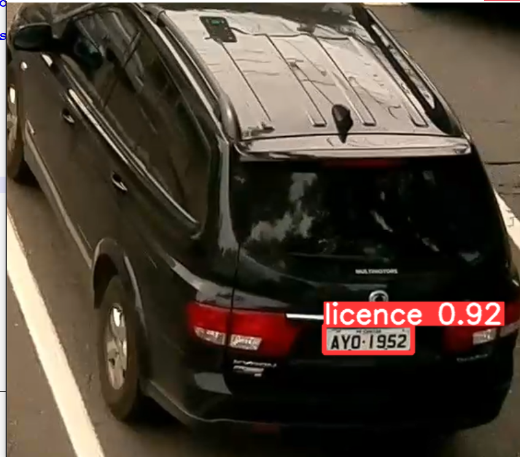
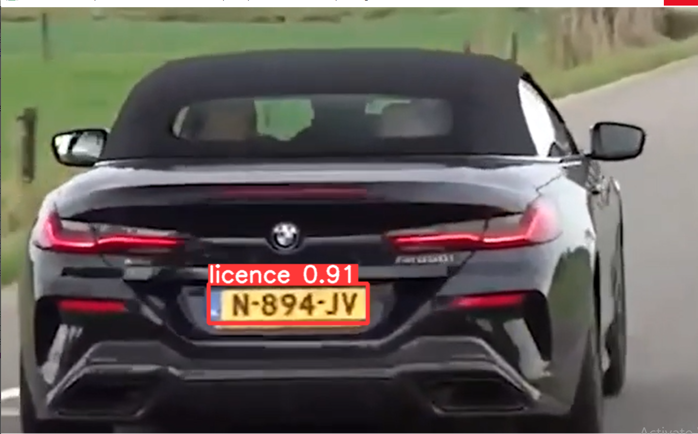

# License_Plate_Detection

  <h1>Code Contain</h1>
  

    
   1. Detection of License Plate Using YOLO_V8 
    
   2. Extract the txt and OCR Confidence Number  from Croping Licesne Plate using EasyOCR
      
  

 <h2>Steps To Run</h2>

   

    
    git clone https://github.com/SondosEmara/License_Plate_Detection.git
        
   
 

   

    
    cd License_Plate_Detection
        
   
 
   

    
    pip install --upgrade pip
        
   

   

    
    pip install -r requirements.txt
        
   

   

    
    Download weight -->  https://drive.google.com/file/d/1Io7XdzJXnCeDClk6J_3SEdCwz4Zk0L_l/view?usp=sharing
        
   

   

    
    Download ultralytics --> https://drive.google.com/drive/folders/1rGKpwbTHLW3wUmq2PwotgN7ntSRez5WI?usp=sharing
        
   

  
   

    
    python LicensePlate.py
        
   

<h3> Demo </h3>

Lisense Plate Detection Using YOLO_V8

  **Test_1**
  
 OCR Result--> Txt (Ayo 4952) , Conf:(0.3558492383989794) 

  
  
  
  

   **Test_2**
   
  
  
  
 OCR Result--> Txt  (N-894-J) , Conf: (0.7528173547376241)  

